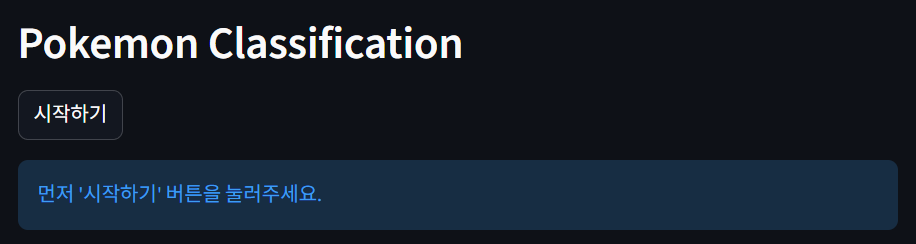
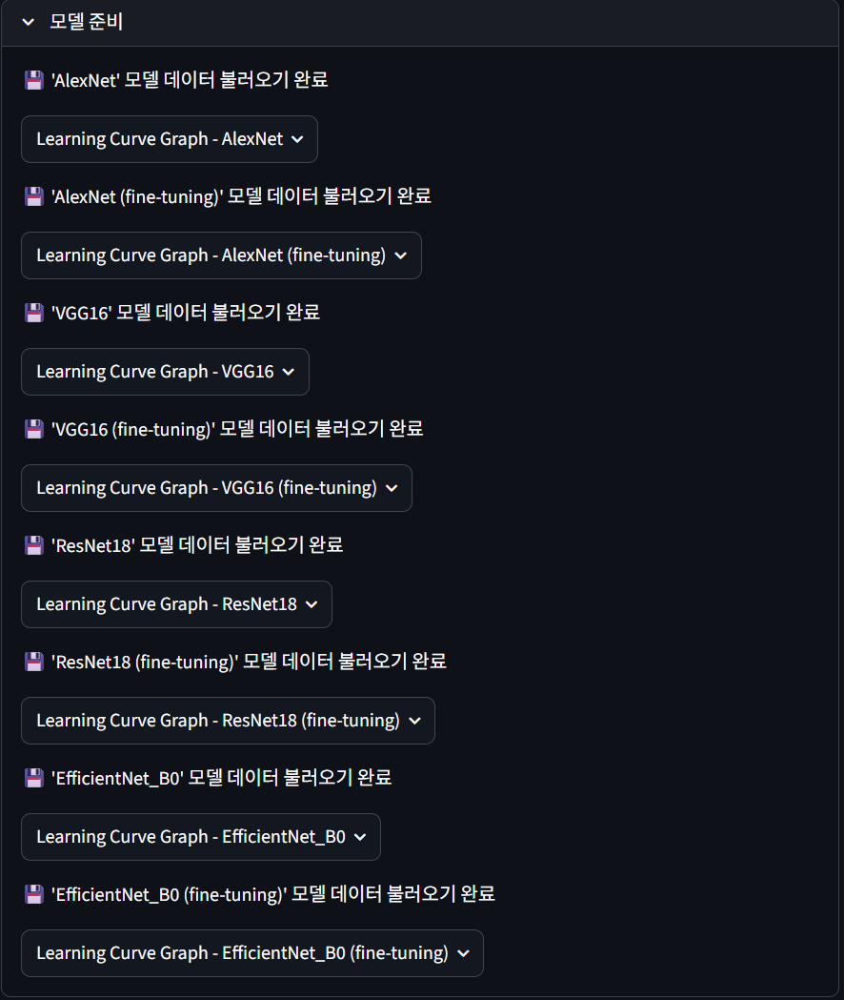
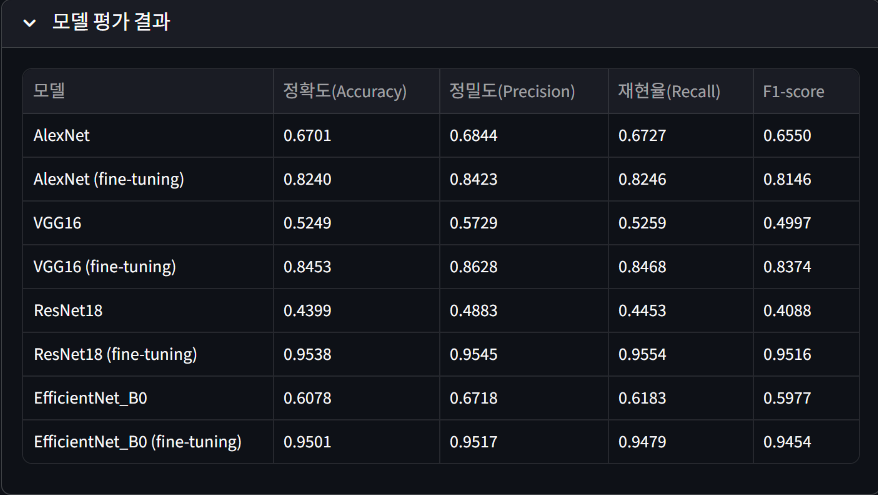
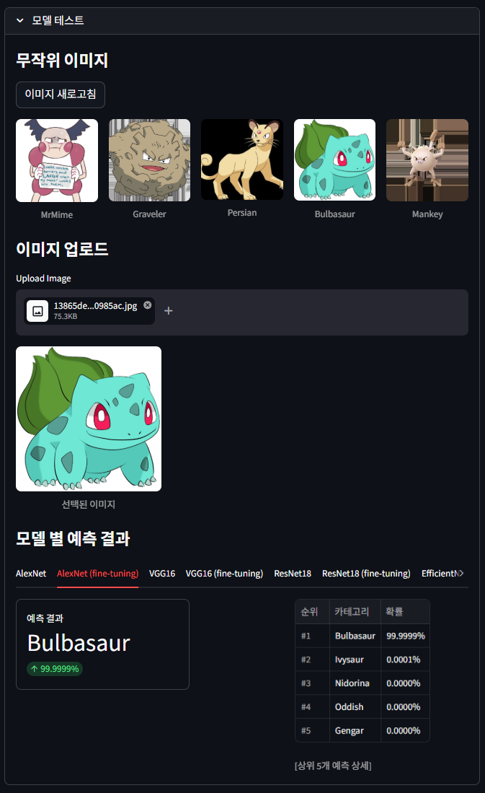
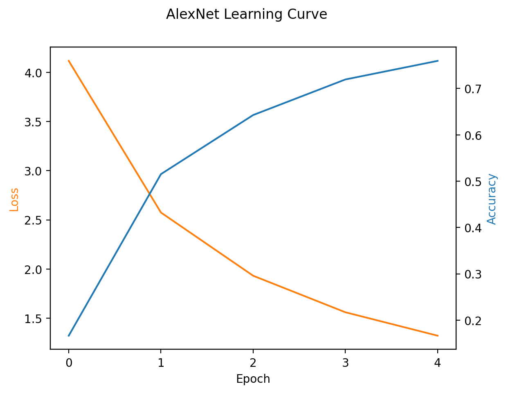
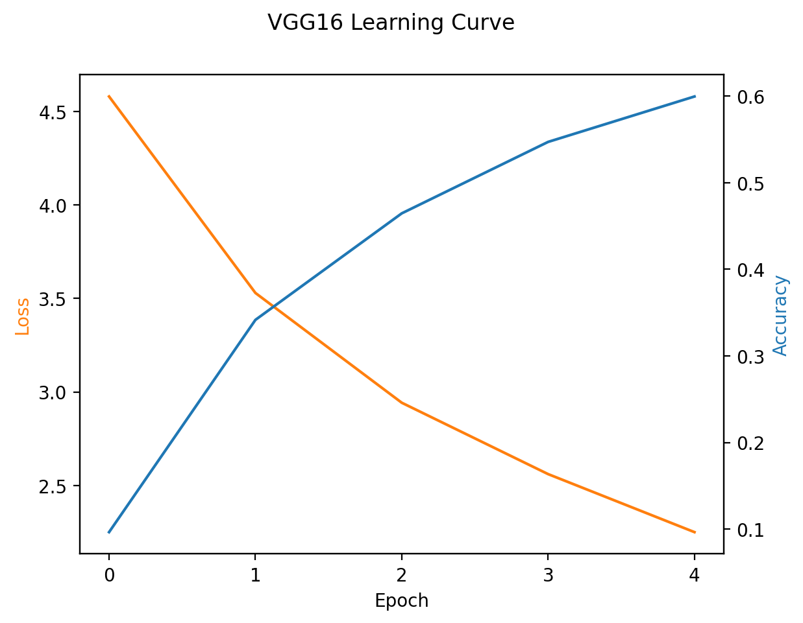
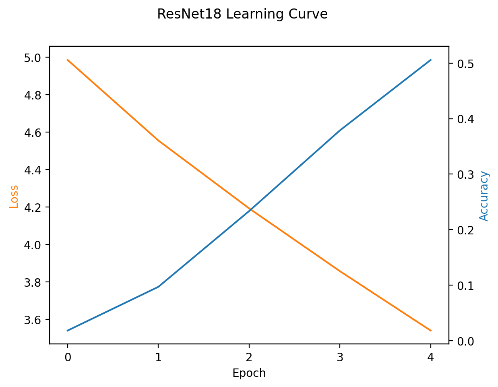
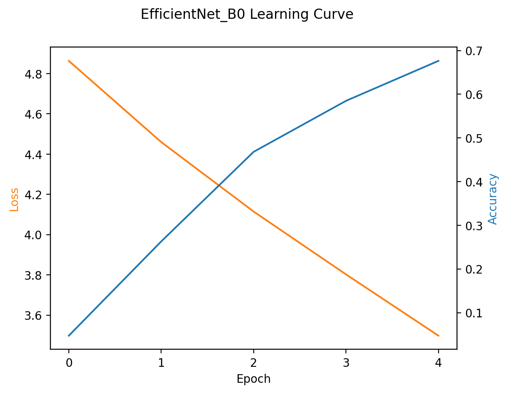

# seoultech-computervision-pokemon-classification

컴퓨터비전 과제 06) Transfer Learning을 사용하여 포켓몬 이미지 분류하기

## 📌 개요

### 프로젝트 목표
Transfer Learning을 활용하여 사전학습된 CNN 모델들을 포켓몬 이미지 분류 작업에 적용하고 각 모델의 성능을 비교 분석한다. 또한 이미지 입력을 통해 각 모델의 예측 결과를 확인하는 테스트를 수행할 수 있다.

## 🔧 사용 방법

### 준비

```bash
pip install -r requirements.txt
```

---

### 실행

```bash
streamlit run app.py
```

---

### 사용 방법 및 예시

#### **① 시작하기**

- "시작하기" 버튼을 클릭하여 시작
- 첫 실행 시 Kaggle에서 데이터 다운로드 (시간 소요)



#### **② 모델 준비**

- 각 모델의 로드/학습 확인
- 학습 시 진행률 표시
- 학습 완료 시 학습곡선(Loss/Accuracy) 그래프 제공



#### **③ 모델 평가 결과**

- 8개 모델의 성능 비교 테이블 제공
- Accuracy, Precision, Recall, F1-score 값을 표로 확인



#### **④ 모델 테스트**

- 데이터셋에서 무작위로 5개의 포켓몬 이미지 표시 (새로고침 가능)
- 표시된 이미지 또는 사용자가 직접 포켓몬 이미지 업로드
- 각 모델의 상위 5개 예측 결과 및 확률 표시



---

## 📊 모델 평가 결과

### 학습 곡선 (Learning Curves)

각 모델의 학습 과정에서 Loss와 Accuracy 변화를 보여주는 학습 곡선입니다.

#### **AlexNet**

| Transfer Learning | Fine-tuning |
|:---:|:---:|
|  | _curve.png) |

#### **VGG16**

| Transfer Learning | Fine-tuning |
|:---:|:---:|
|  | _curve.png) |

#### **ResNet18**

| Transfer Learning | Fine-tuning |
|:---:|:---:|
|  | _curve.png) |

#### **EfficientNet_B0**

| Transfer Learning | Fine-tuning |
|:---:|:---:|
|  | _curve.png) |

### 전체 모델 성능 비교표

| 모델 | 정확도 (Accuracy) | 정밀도 (Precision) | 재현율 (Recall) | F1-score |
|------|:---------:|:----------:|:---------:|:-------:|
| AlexNet | 0.6701 | 0.6844 | 0.6727 | 0.6550 |
| AlexNet (Fine-tuning) | 0.8240 | 0.8423 | 0.8246 | 0.8146 |
| VGG16 | 0.5249 | 0.5729 | 0.5259 | 0.4997 |
| VGG16 (Fine-tuning) | 0.8453 | 0.8628 | 0.8468 | 0.8374 |
| ResNet18 | 0.4399 | 0.4883 | 0.4453 | 0.4088 |
| ResNet18 (Fine-tuning) | 0.9538 | 0.9545 | 0.9554 | 0.9516 |
| EfficientNet_B0 | 0.6078 | 0.6718 | 0.6183 | 0.5977 |
| EfficientNet_B0 (Fine-tuning) | 0.9501 | 0.9517 | 0.9479 | 0.9454 |

참고: 테스트 데이터셋(20%)에 대한 평가 결과